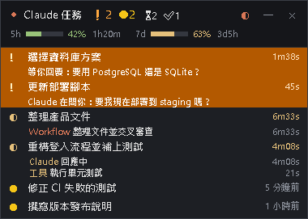
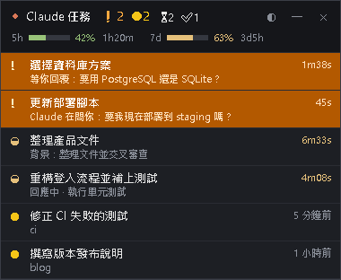

# claude-task-hud

**task-hud**：Claude Code 的懸浮任務與用量視窗。一眼看到所有 Claude Code 工作階段誰在跑、誰在等你、誰做完了，以及 5 小時／7 天用量。

A floating, always-on-top task and usage HUD for Claude Code. [English below ↓](#english)

<p>
  
  
</p>

<sub>左：預設的「只看執行中與用量」；右：「全部工作階段」。最上面兩列橘色的是「在等你回覆」，最下面兩列的黃點 ● 是做完但還沒在 Claude desktop app 打開的。截圖用的是合成的示範資料（`tools/screenshot.py`）。<br>Left: the default “running + usage” view; right: “all sessions”. The two orange rows at the top are waiting for your reply; the yellow dots ● at the bottom mark sessions that finished but haven't been opened in the Claude desktop app yet. Synthetic demo data.</sub>

---

## 中文

### 功能

**懸浮視窗（Windows）**——桌面上永遠置頂的小視窗，同時列出所有 Claude Code 工作階段：

- **狀態**：**在等你回覆 ❗**（整列橘色脈動，見下方）、執行中（轉動的 ◐）、可能在等你 ⏸（執行中但 transcript 5 分鐘沒動靜、背景工作很久沒動靜等推斷不出來的情況）、完成 ✅、結束時有錯誤 ⚠、工作階段已結束 ⛔；做完但還沒在 Claude desktop app 打開的是黃點 ●（見下方）。
- **標題列**：❗ 在等你（橘色，有才顯示）、● 做完還沒打開（黃色，有才顯示）、⏳ 執行中、⏸ 可能在等你、✅ 最近一小時完成的數量。
- **用量**：5h／7d 用量條與百分比（綠 < 50%、黃 50–79%、紅 ≥ 80%），以及距離重置的倒數；過了重置時間顯示「已重置」。只有 Claude 訂閱帳號才有這項資料（見[已知限制](#已知限制)）。
- **兩種檢視**：預設是「只看執行中與用量」，只列在等你／執行中／可能在等你的工作階段，底下列出正在跑的工作（Claude 主回合、工具、Agent、背景指令、Workflow、監看），最後是做完但還沒打開的（每個一行，最多 4 個，其餘顯示「+N 個未讀」），最多 12 行。按標題列的 **◐** 切換成「全部工作階段」（最多 8 列，含剛完成、閒置、剛結束的）。
- **右鍵選單**：顯示：全部工作階段／顯示：只看執行中與用量、音效、永遠置頂、透明度（100／90／80／70%）、重新整理、結束。在工作階段上按右鍵另外有「在 Claude 開啟」、「標為已讀」與「從清單移除」（只記在懸浮視窗的 `widget.json`；那個工作階段有新動作就重新出現，例如已在 app 刪掉、但紀錄檔還在的工作階段）。
- **點一下開啟**：點一下工作階段（不拖曳）就在 Claude desktop app 打開它，見下方。
- **收合**：按 **—** 或雙擊標題列，只留標題列與用量；收合時完成提示改閃整個標題列，有工作階段在等你時整個標題列持續橘色脈動。
- **移動**：拖曳標題列，位置會記住；靠近螢幕底部時往上長，不會超出所在螢幕的工作區。
- **單一實例**：重複開啟只會把現有的視窗叫到前面。

**在等你回覆（醒目標示）**——Claude 停下來等你的時候，那個工作階段變成 ❗：

- **什麼時候算**：
  - Claude 用 `AskUserQuestion` 問你問題、還沒回答（顯示「等你回覆：第一個問題」）。
  - Claude 用 `ExitPlanMode` 提出計畫、等你確認（「等你確認計畫」）。
  - 畫面上跳出工具的權限確認（「等你核准：工具」），或 MCP 伺服器要你輸入資料（「等你輸入」）。
  - 回合正常結束，而且 Claude 最後一句是問句（以 `？` 或 `?` 結尾，忽略結尾的空白、markdown、emoji、括號與引號；顯示「Claude 在問你：最後一句」）。以程式碼區塊結尾、問號在行內程式碼裡（例如 SQL 的 `?` 參數、`empty?`），或是表示存疑的「(?)」不算。subagent 的回合結束不算。
- **怎麼標示**：那一列排到最前面（兩種檢視都是，只看執行中模式也一定看得到），整列在兩個橘色之間脈動、標題變粗體，時間欄顯示已經等你多久；標題列多一個橘色的 **❗N**；收合時整個標題列跟著脈動。
- **提示音**：剛開始等你時響一次和完成提示不同的短促兩聲（音效開著時）；同一次等待不會重複響，剛開啟視窗時已經在等的不響。同一刻只響一種聲音：剛好同時做完又在等你時，只響「在等你」，完成那一列照樣閃。
- **什麼時候解除**：你回答、核准或拒絕、送出下一個提示（`/cost` 這類本機斜線指令不算）、工作階段結束或 `/clear`。
- **怎麼判斷**：有裝外掛的工作階段由外掛回報。沒裝外掛的工作階段從 transcript 推斷問題、計畫與回合最後的問句；**權限確認與 MCP 輸入對話框**則讀 Claude Code 自己的行程登記（`~/.claude/sessions/<pid>.json`，Claude Code 會在那裡寫「正在等你」），所以沒裝外掛也偵測得到（Claude Code 2.1.286 會寫這個狀態；更舊的版本沒有時，沒裝外掛的工作階段就偵測不到權限確認）。權限確認要持續 1.5 秒以上才算，被規則或自動模式直接核准的不會亮。

**做完但還沒打開（黃點）**——和 Claude desktop app 側邊欄左邊的黃點一樣：工作階段做完了，你還沒在 app 裡打開它看結果。

- **怎麼標示**：圖示換成黃色的 ●（執行中、在等你的仍然用自己的圖示），標題列多一個黃色的 **●N**。只看執行中模式在「在等你」與「執行中」的後面每個列一行（最多 4 個，較早的併成「+N 個未讀」，不會擠掉執行中的），時間欄是多久前做完；標題優先用 app 側邊欄的標題。只看最近 6 小時內做完的（和其他功能一樣），所以 ●N 可能比 app 側邊欄的黃點少。
- **排程工作**：app 的排程工作（scheduled task）每次自動跑完都會被 app 標成未讀，通常沒有人去打開；這些只在「全部工作階段」畫面顯示**暗一點的黃點**，不算進 ●N，也不列進只看執行中模式（不然每次排程都會冒出一行）。
- **什麼時候消失**：你在 desktop app 打開它（在懸浮視窗點一下那一列也可以），或在那一列按右鍵 →「標為已讀」。「標為已讀」只記在懸浮視窗自己的設定（`widget.json` 的 `readMarks`），不會改 desktop app 的資料，所以 app 側邊欄的黃點還在；那個工作階段再做完一次、又開始工作，或 7 天後，這個標記就自動作廢。
- **怎麼判斷**：唯讀 desktop app 自己記的未讀清單（Local Storage 裡的一個 key，檔案沒變不重讀，最多每 3 秒看一次），再用 app 的工作階段資料對到 Claude Code 的工作階段。app 正在整理資料（檔案剛好被改名、刪掉或鎖住）時先沿用上一次讀到的清單，3 秒後再讀。讀不到清單時改用推斷：完成時間比你上次在 app 裡看那個工作階段（`lastFocusedAt`）晚 3 秒以上就算沒看過。封存的工作階段不算。
- **需要 Claude desktop app**：只用 CLI（終端機）的工作階段不會有黃點，沒裝 desktop app 時這個功能自動關閉，其他功能不受影響。

**點一下開啟**——在懸浮視窗點一下工作階段的那一列（按下到放開沒有移動；拖曳視窗仍然是拖標題列），就用 `claude://claude.ai/epitaxy/<id>` 在 Claude desktop app 打開那個工作階段。只有 desktop app 開的工作階段（知道它在 app 裡的 id）可以點，滑鼠移上去會變成手指；右鍵「在 Claude 開啟」也一樣。

**完成提示**——一個工作階段的工作「全部」結束（包含背景工作）並靜置幾秒之後才提示：那一列閃綠色 12 秒（有錯誤閃紅色），並發出兩聲提示音。整段忙碌不到 10 秒就做完的只閃不叫；你自己中斷（Esc）的不提示。

**背景工作**——Workflow、背景 Bash（`run_in_background`）、背景 Agent、Monitor 還在跑時，即使 Claude 的回合已經結束，工作階段仍算「執行中」，直到它們真的結束（收到完成通知）才算完成。Artifact 的自動追蹤（發佈或讀過 Artifact 之後，Claude Code 會在背景持續接收它的留言與更新）整個工作階段都開著，不算在跑的工作。從 transcript 推斷時，15 分鐘沒動靜的背景工作會標成「N 分鐘無動靜」。

**進度與預估剩餘時間**——只看執行中模式，在工作列的耗時左邊顯示：

- **Workflow**：`階段 2/4 · 60% · 約剩 8 分`。分母是 script 開頭 `meta.phases` 宣告的階段數；每個階段各算「已結束的 agent ÷ 已開始的 agent」再加總（`pipeline()` 讓好幾個階段同時在跑時寫成「階段 2–4/4」；script 跳過的階段算做完）。預估時間是「已經跑了多久 × 剩下的比例」，每有一個 agent 結束就重算，中間每秒倒數；超過預估就只留百分比。沒有宣告 phases 的 script 只顯示 agent 的「已結束/已開始」。
- **工作階段**：這段忙碌期有 2 個以上的子任務（背景 Agent、背景指令、Workflow、監看；不算回合、前景工具與前景 Agent）時，工作階段那一列顯示完成數，例如 `2/5`；所有在跑的子任務都有預估、主回合也沒在跑時，再加上最久的那個預估。「全部工作階段」畫面也在時間欄前面顯示這段文字。
- **背景指令、Agent、一般回合**沒有總量可以算，只顯示耗時，不顯示猜出來的數字。
- **展開**：可以展開的列最左邊有 **▸**，點箭頭展開（變成 **▾**），再點一次收合；點列的其他地方照舊在 Claude 開啟。工作階段展開後列出這段忙碌期的全部子任務（做完的變暗、打勾，時間是花了多久）；Workflow 展開後列出每個 agent（● 執行中、✓ 完成、✗ 失敗；有多個階段時前面加階段名），最多 15 行，其餘併成「+N 個已完成」。畫面上有展開的列時，只看執行中模式最多 30 行。展開狀態記在 `widget.json`。
- **預估只是粗估**：用 76 個做完的 workflow 回測，只有大約一半落在實際時間的 2 倍以內，所以寫「約剩」。

**沒裝外掛的工作階段**——沒有外掛資料（或資料超過 45 秒沒更新）的工作階段，會從 `~/.claude/projects` 的 transcript 唯讀推斷狀態（只看最近 6 小時有活動的）。

**Claude Code 內**：

| 指令 | 說明 |
| --- | --- |
| `/task-float` | 開啟懸浮視窗（Windows）。找不到 Python 或開不起來時會說明原因。 |
| `/task-hud` | 在 Claude Code 裡開一個面板：在等你時的橘色橫幅、完成橫幅、用量（5 小時、7 天、context、本次對話花費）、執行中與最近完成的工作；按 `c` 清除已完成。所有平台都能用。 |

另外會用 toast 提示：Claude 在等你（例如「❗ Claude 等你回覆：…」、「❗ Claude 在問你：…」、「❗ Claude 等你核准：…」，每次等待一次）、背景工作與 subagent 完成、全部完成，以及回合結束時背景還有工作在跑。

### 需求

- **Claude Code 2.1.286 以上。** 本外掛用的是外掛的 **hooks module（function hooks）**，這是 early access 功能，官方文件說明這個 API 會隨版本變動（以引擎產生的型別宣告為準）。2.1.284 以前的版本會拒絕載入整個 hooks module（`claude plugin validate` 會顯示 `"session.append" is not an event`），`/task-hud`、`/task-float` 都不會出現。用 `claude --version` 確認版本，舊版用 `claude update` 更新。本外掛在 2.1.286 上測試。
- **懸浮視窗**：Windows 10／11，以及 **Python 3.10 以上（含 tkinter）**。python.org 安裝程式與 Microsoft Store 版預設都含 tkinter。外掛會依序嘗試 `pythonw`、`pyw -3`（py 啟動器），所以安裝時沒勾「Add python.exe to PATH」也沒關係。
- macOS／Linux：`/task-hud` 面板可以用；懸浮視窗目前只支援 Windows，外掛不會自動開啟它。
- **黃點與點一下開啟**：需要 Claude desktop app（Windows 版，含 Microsoft Store 版）。只用 CLI 時看不到黃點，也不能點一下開啟。

### 安裝

```sh
claude plugin marketplace add vic0919/claude-task-hud
claude plugin install task-hud@claude-task-hud
```

然後重新啟動 Claude Code（或在已開啟的工作階段裡執行 `/reload-plugins`）。也可以在 Claude Code 裡輸入 `/plugin`，用介面加入 marketplace 並安裝。

**不經過 marketplace，直接從資料夾載入**（試用或開發）：

```sh
git clone https://github.com/vic0919/claude-task-hud
claude --plugin-dir ./claude-task-hud/plugins/task-hud
```

由 desktop app 或 SDK 啟動、沒辦法加參數的工作階段，可以改設 `CLAUDE_CODE_PLUGIN_DIRS`：一個或多個絕對路徑（可用 `~`），用平台的路徑分隔符號隔開（Windows 是 `;`），放在環境變數或 `~/.claude/settings.json` 的 `env` 裡（專案的 settings 不算）。

### 更新

```sh
claude plugin marketplace update claude-task-hud
claude plugin update task-hud@claude-task-hud
```

然後重新啟動 Claude Code。懸浮視窗如果開著，跑的還是舊版的程式：在視窗上按右鍵 →「結束」，再用 `/task-float` 重新開啟。

### 疑難排解

**安裝並重新啟動後，`/task-hud` 顯示沒有這個指令：**

1. 用 `claude --version` 確認是 2.1.286 以上。
2. 檢查安裝好的外掛資料夾，引擎拒絕載入時會列出原因（版本號換成你裝的版本）：
   `claude plugin validate ~/.claude/plugins/cache/claude-task-hud/task-hud/0.6.1`
   （Windows 的 cmd／PowerShell：`%USERPROFILE%\.claude\plugins\cache\claude-task-hud\task-hud\0.6.1`）。也可以用 `claude --debug` 啟動，看記錄裡的 `task-hud`。
3. 這個功能由 Claude Code 控制開關。可以在環境變數或 `~/.claude/settings.json` 的 `env` 裡設 `"CLAUDE_CODE_ENABLE_FUNCTION_HOOKS": "1"` 強制開啟，再重新啟動 Claude Code。
4. `--bare` 模式不會載入已安裝外掛的 hooks module；組織的 managed settings 設了 `allowManagedHooksOnly` 或 `disableAllHooks` 時也不會載入。

**`/task-float` 說找不到 Python：** 安裝 Python 3.10 以上（含 tkinter），再執行一次 `/task-float`；外掛會重新尋找。

### 使用

- **自動開啟**（Windows）：每個工作階段的第一個回合開始時，如果懸浮視窗沒開就自動開啟，不搶焦點。排程工作不會自動開啟；`claude -p`、SDK 等腳本啟動的工作階段也會自動開啟。
- 按視窗右上角的 **×**（或右鍵「結束」）關閉後就不再自動開啟，之後用 `/task-float` 打開會恢復自動開啟。視窗剛出現或剛移動的 0.6 秒內按到 × 不算，免得游標底下突然冒出視窗時誤關；按下後移開再放開也會取消。
- 建議用 `/task-float` 開啟。也可以直接執行安裝資料夾裡的程式（版本號換成你裝的版本）：
  `pythonw "%USERPROFILE%\.claude\plugins\cache\claude-task-hud\task-hud\0.6.1\widget\task_hud_widget.pyw"`
- 懸浮視窗永遠置頂，會顯示每個工作階段的標題（第一個提示）。分享螢幕前可以先收合（**—**）或結束。

### 設定

懸浮視窗的設定檔是 `~/.claude/task-hud/widget.json`（Windows：`%USERPROFILE%\.claude\task-hud\widget.json`），由視窗自己寫入，大多可以從右鍵選單調整。要手動修改請先關掉視窗，否則會被覆寫。

| key | 預設 | 說明 |
| --- | --- | --- |
| `autoOpen` | `true` | 第一個回合開始時自動開啟。按 × 關閉會設成 `false`，下次開啟視窗會改回 `true`。 |
| `mode` | `"running"` | `"running"`：只看執行中與用量；`"all"`：全部工作階段。 |
| `sound` | `true` | 完成提示音與「在等你」提示音。 |
| `topmost` | `true` | 永遠置頂。 |
| `alpha` | `0.94` | 不透明度，0.3–1.0。 |
| `collapsed` | `false` | 收合。 |
| `x`, `y` | 自動 | 視窗位置。刪掉就回到主螢幕右上角。 |
| `readMarks` | 無 | 右鍵「標為已讀」的工作階段：`{session id: 那次完成的時間（毫秒）}`。最多 200 個；那個工作階段再做完一次、又開始工作或 7 天後自動刪掉。沒有標記時不寫這個 key。 |
| `expanded` | 無 | 只看執行中模式裡展開中的列：工作階段是 session id，Workflow 是 `session id/run:<runId>`。最多 200 個；工作階段從清單消失時自動刪掉。沒有展開時不寫這個 key。 |

更新頻率、只看最近幾小時等常數在 `task_hud_widget.pyw` 開頭的「可調整的設定」。

有設 `CLAUDE_CONFIG_DIR` 時，本文件裡的 `~/.claude` 都換成那個資料夾（外掛與懸浮視窗都會跟著改）。

### 資料與隱私

- **全部在本機，沒有任何網路連線。** 懸浮視窗只在 `127.0.0.1:47391` 開一個連接埠，用來確保只有一個視窗。點一下開啟只是請 Windows 開 `claude://` 連結，由 desktop app 處理。
- 外掛寫入 `~/.claude/task-hud/sessions/<sessionId>.json`：工作階段標題（第一個提示的前 80 個字）、工作目錄、工作清單（Workflow 另含它的執行資料夾與 script 路徑）、這段忙碌期的開始時間、用量，以及在等你時的說明（例如 `AskUserQuestion` 的第一個問題、要核准的工具標籤、回合最後那句問句的前 60 個字）。工作清單含工具標籤，例如指令的說明（沒有說明時是指令的前 60 個字）、檔名、網址、搜尋字串、Grep 樣式；這些本來就記在 transcript 裡。內容有變才寫，沒變每 15 秒寫一次當心跳。只有 Windows 會寫這個檔（只有懸浮視窗會讀它）。
- 外掛只在有權限確認對話框開著時，讀 `~/.claude/sessions/*.json` 找出這個工作階段自己的行程登記（最多讀最近改過的 20 個檔），看你是不是已經回應；其他時候不讀，也從不寫入。
- 懸浮視窗**唯讀**（從不寫入或修改這些檔案）：
  - `~/.claude/projects/**/*.jsonl`：最近 6 小時有更新的 transcript。判斷狀態通常只讀檔尾（包含回合最後一段文字，用來判斷是不是問句）；找不到標題時會掃描 30 MB 以下的整個檔案；偵測背景工作時，第一次最多讀每個檔案的最後 64 MB，之後只讀新增的部分。
  - `~/.claude/sessions/*.json`：Claude Code 自己的行程登記（每秒看一次，檔案沒變不重新讀）。懸浮視窗會向 Windows 查詢登記裡的行程是否還在跑、何時啟動，用來判斷背景工作還在不在、工作階段還開著沒；登記裡的狀態（忙碌、閒置、正在等你核准或輸入）用來標示「在等你」；desktop app 開的工作階段，登記裡另有它在 app 裡的 id（點一下開啟用）。
  - Claude desktop app 的資料（有裝 desktop app 時才有；`%APPDATA%\Claude`，Microsoft Store 版在 `%LOCALAPPDATA%\Packages\Claude_*\LocalCache\Roaming\Claude`）：
    - `claude-code-sessions\<帳號>\<組織>\local_*.json`：每個工作階段在 app 裡的 id、對應的 Claude Code session id、側邊欄標題、上次打開與活動的時間、是否封存、是不是排程工作跑出來的。只解析最近改過的與未讀的，檔案沒變不重新讀；`deleted_*.json` 不讀。
    - `Local Storage\leveldb` 裡的**一個** key：`epitaxy-unread-v1`（側邊欄的未讀清單，也就是黃點）。只找這個 key，Local Storage 的其他內容不解讀；檔案沒變不重讀，最多每 3 秒看一次。
    - 用允許 app 同時寫入、改名、刪除的方式開檔，讀進記憶體就關掉，不會擋到 app；鎖住、截斷或壞掉的檔案略過。絕不寫入、鎖住或修改 app 的任何檔案。
  - 修改時間：transcript 旁的 `subagents` 資料夾，以及背景工作的輸出檔（暫存資料夾裡的，或 transcript 裡寫到的路徑）。
  - Workflow 的執行資料夾（transcript 旁的 `<session>/subagents/workflows/<runId>/`）：`journal.jsonl`（只讀新增的部分）、每個 agent 檔的修改時間，以及 `agent-<id>.meta.json` 的說明；還有 Workflow 的 script（只讀前 64 KB，取出 `meta.phases` 的階段名稱）。只在那個 Workflow 還在跑時讀。
- 懸浮視窗寫入：`~/.claude/task-hud/widget.json`（設定，包含「標為已讀」）、`~/.claude/task-hud/widget.log`（錯誤記錄，以及視窗啟動與被你關閉的時間，上限約 200 KB）。
- 自動清理：懸浮視窗開著時，每 10 分鐘刪除 `~/.claude/task-hud/sessions/` 裡已結束超過 24 小時、或 3 天沒更新的檔案。視窗關著時不會清理，下次開啟時才補清。不會修改或刪除任何 transcript。

### 解除安裝

先在懸浮視窗按右鍵 →「結束」，然後：

```sh
claude plugin uninstall task-hud@claude-task-hud
claude plugin marketplace remove claude-task-hud
```

最後可以刪掉 `~/.claude/task-hud` 資料夾（設定、記錄與工作階段檔）。

### 已知限制

- **5h／7d 用量只有用 Claude 訂閱帳號（例如 Pro、Max）登入時才有。** 用 API key，或 Amazon Bedrock、Google Vertex AI 等第三方供應商時，Claude Code 本身就沒有這項資料：懸浮視窗會一直顯示「用量：等待 5h／7d 資料…」，`/task-hud` 面板仍會顯示 context 與花費。
- **用量只在「有裝這個外掛的工作階段」收到 API 回應時更新。** 沒有工作階段在跑時，用量條停在最後一次的數字（過了重置時間會顯示「已重置」）。
- **懸浮視窗只支援 Windows**（`/task-hud` 面板各平台都能用）。
- **從 transcript 推斷的狀態是啟發式的**，可能短暫誤判，例如很久沒有輸出的工具會被當成「可能在等你回應」（行程登記說 Claude 還在忙時不會）。有裝外掛的工作階段不受影響。
- **「Claude 在問你」只看最後一句是不是以 `？`／`?` 結尾**：反問句也會亮，沒用問號的請求（例如「請告訴我要用哪個」）不會亮。從 transcript 推斷的要在回合結束後穩定 3 秒才亮，避免 Stop hook 接著開始下一個回合時誤報。
- **沒裝外掛、而且 Claude Code 沒寫行程登記的狀態（舊版）時**：偵測不到權限確認；從 transcript 推斷的「在等你」也無法確認工作階段還開著，最多只標示 1 小時。
- 外掛 hooks API 是 early access，Claude Code 更新後可能需要跟著更新外掛。
- 外掛在工作階段中途才載入時，載入前就在跑的背景工作要等完成通知才會出現。
- 只顯示最近 6 小時有活動的工作階段；全部模式最多 8 列，只看執行中模式最多 12 行（其中做完還沒打開的最多 4 個；畫面上有展開的列時最多 30 行）。
- **進度百分比只有 Workflow 有**，而且要 script 宣告了 `meta.phases`（舊版 Claude Code 的 journal 沒有階段資訊時只顯示 agent 數）；agent 總數要跑了才知道，所以新的 agent 開始時百分比可能往回掉。預估剩餘時間只是粗估。
- **黃點需要 Claude desktop app**，只用 CLI 的工作階段沒有黃點。它讀的是 app 內部、沒有公開的資料格式：app 更新改了格式時，黃點會改用推斷（`lastFocusedAt`）或消失，其他功能不受影響。「標為已讀」只影響懸浮視窗，不會清掉 app 側邊欄的黃點。

### 運作方式

- `plugins/task-hud/hooks/register.tsx`：hooks module。追蹤回合、工具呼叫、背景工作（`tool.call`、`session.append` 的完成通知、`classic.Stop` 回報的背景清單、`$.agent.list`）、在等你（`AskUserQuestion`／`ExitPlanMode` 的工具呼叫、權限確認與 MCP 輸入對話框、回合結束時最後一句是問句）與用量（`session.measure`），每秒把變化寫成工作階段檔，並提供 `/task-hud`、`/task-float`。
- `plugins/task-hud/widget/task_hud_widget.pyw`：懸浮視窗（只用 Python 標準函式庫）。合併外掛寫的工作階段檔、從 transcript 推斷的狀態、Claude Code 行程登記裡「正在等你」的狀態，以及 Claude desktop app 的工作階段資料與未讀清單（黃點；內含讀 LevelDB 的最小純 Python 實作）。
- `plugins/task-hud/types/index.d.ts`：工作階段檔與外掛狀態的型別。

### 開發

```sh
# 無視窗自我測試，只用合成的測試資料
python plugins/task-hud/widget/task_hud_widget.pyw --selftest
# 選用：再把你自己的一個 transcript 分段重播（只在本機讀取）
python plugins/task-hud/widget/task_hud_widget.pyw --selftest --replay ~/.claude/projects/<專案>/<session>.jsonl
# 用測試資料開真視窗約 3 秒後自動關閉（連接埠 47392，不影響正在用的視窗）
python plugins/task-hud/widget/task_hud_widget.pyw --smoke

# 驗證 marketplace 與外掛（hooks module 會被掃描；需要 Claude Code 2.1.286 以上）
claude plugin validate .
claude plugin validate plugins/task-hud

# 從資料夾載入，存檔會自動重新載入 hooks module
claude --plugin-dir plugins/task-hud

# 用示範資料重新產生 README 截圖（Windows）
python tools/screenshot.py docs/screenshot-running.png --mode running
python tools/screenshot.py docs/screenshot-all.png --mode all
```

型別檢查：在 Claude Code 裡執行 `/plugin-types` 產生引擎的型別宣告（`claude-code.d.ts`），再用 TypeScript 5.4 以上檢查 `hooks/register.tsx`（tsconfig 範例寫在那個宣告檔開頭）。

發佈新版時，`plugins/task-hud/.claude-plugin/plugin.json` 與 `.claude-plugin/marketplace.json` 的 `version` 都要調高、而且保持一致，使用者執行 `claude plugin update` 才會拿到新版。

### 授權

[MIT](LICENSE)

---

## English

### What it does

**Floating window (Windows)** — a small always-on-top window that lists every Claude Code session at once:

- **Status**: **needs you ❗** (the whole row pulses orange, see below), running (spinning ◐), maybe waiting for you ⏸ (cases it can't tell for sure, e.g. a running session whose transcript has been silent for 5 minutes, or background work that has been quiet for a long time), done ✅, finished with an error ⚠, session ended ⛔; a session that finished but hasn't been opened in the Claude desktop app yet gets a yellow dot ● (see below).
- **Header**: counts of ❗ needs you (orange, shown only when non-zero), ● finished but not opened yet (yellow, shown only when non-zero), ⏳ running, ⏸ maybe waiting and ✅ finished in the last hour.
- **Usage**: 5h / 7d usage bars with percentages (green < 50%, yellow 50–79%, red ≥ 80%) and a countdown to the reset; once the reset time passes it shows 「已重置」 (reset). Only Claude subscription accounts have these figures (see [Known limitations](#known-limitations)).
- **Two views**: the default, 「只看執行中與用量」 (running + usage only), lists only sessions that need you, are running or may be waiting, with the work running under each (Claude's turn, tools, agents, background shells, workflows, monitors), followed by sessions that finished but haven't been opened yet (one line each, at most 4, the rest summed up as 「+N 個未讀」 — N more unread), up to 12 lines. Click **◐** in the header to switch to 「全部工作階段」 (all sessions: up to 8 rows, including recently finished, idle and just-ended ones).
- **Right-click menu**: view (all sessions / running + usage), sound, always on top, opacity (100/90/80/70%), refresh, quit. Right-clicking a session adds 「在 Claude 開啟」 (open in Claude), 「標為已讀」 (mark as read) and 「從清單移除」 (remove from list: stored only in the window's `widget.json`; the session comes back when it does something new, handy for a session deleted in the app whose transcript is still on disk).
- **Click to open**: click a session (without dragging) to open it in the Claude desktop app, see below.
- **Collapse**: click **—** or double-click the header to keep only the header and usage; while collapsed, the completion alert flashes the whole header, and the whole header keeps pulsing orange while a session needs you.
- **Move**: drag the header; the position is remembered, and the window grows upward near the bottom of a screen instead of running off it.
- **Single instance**: opening it again just brings the existing window to the front.

**Needs-you highlight** — when Claude stops and waits for you, that session turns ❗:

- **When**:
  - Claude asked you something with `AskUserQuestion` and you haven't answered (shows 「等你回覆：…」 — waiting for your reply — followed by the first question).
  - Claude proposed a plan with `ExitPlanMode` and is waiting for you to approve it (「等你確認計畫」).
  - A tool permission prompt is on screen (「等你核准：…」 followed by the tool), or an MCP server asks you for input (「等你輸入」).
  - The turn ended normally and Claude's last sentence is a question (ends in `？` or `?`, ignoring trailing whitespace, markdown, emoji, brackets and quotes; shows 「Claude 在問你：…」 followed by that last sentence). A reply that ends with a code block, whose `?` sits inside inline code (an SQL `?` placeholder, `empty?`), or that ends with a doubtful “(?)” doesn't count, and neither does a subagent finishing its turn.
- **How it shows**: the row moves to the top (in both views; it always appears in the running-only view), pulses between two oranges with a bold title, and the time column shows how long it has been waiting; the header gains an orange **❗N**; while collapsed, the whole header pulses.
- **Sound**: a short double beep, different from the completion beep, when the wait starts (if sound is on); once per wait, and not for sessions that were already waiting when the window opened. Only one sound plays at a time: if a session finishes and starts waiting at the same moment, only the needs-you beep plays, and the finished row still flashes.
- **Clears when**: you answer, approve or deny, send the next prompt (a local slash command such as `/cost` doesn't count), the session ends, or you `/clear`.
- **How it's detected**: sessions with the plugin report it themselves. For sessions without the plugin, questions, plans and a question at the end of a turn are inferred from the transcript; **permission prompts and MCP input dialogs** come from Claude Code's own process registry (`~/.claude/sessions/<pid>.json`, where Claude Code records that it is waiting for you), so they are detected even without the plugin (Claude Code 2.1.286 writes this status; on older versions that don't, permission prompts can't be detected for sessions without the plugin). A permission prompt must stay open for 1.5 s to count, so prompts approved instantly by rules or auto mode don't light up.

**Finished but not opened yet (yellow dot)** — the same as the yellow dot on the left of the Claude desktop app's sidebar: the session finished and you haven't opened it in the app to look at the result.

- **How it shows**: the icon becomes a yellow ● (running and needs-you sessions keep their own icons) and the header gains a yellow **●N**. The running-only view lists these sessions after the needs-you and running ones, one line each (at most 4; older ones are summed up as 「+N 個未讀」 and never push running sessions out), with how long ago they finished; the title prefers the app's sidebar title. Only sessions that finished in the last 6 hours count (like everything else in the window), so ●N can be lower than the number of dots in the app's sidebar.
- **Scheduled tasks**: the app marks every automatic run of a scheduled task as unread, and those runs usually never get opened. They only get a **dimmer dot** in the all-sessions view; they don't count in ●N and aren't listed in the running-only view (otherwise every scheduled run would add a line).
- **Goes away when**: you open the session in the desktop app (clicking its row in the floating window does that too), or right-click the row → 「標為已讀」 (mark as read). Mark as read is stored only in the window's own settings (`readMarks` in `widget.json`) and never changes the desktop app's data, so the app's sidebar keeps its dot; the mark is dropped automatically when that session finishes again, starts working again, or after 7 days.
- **How it's detected**: the window reads, read-only, the unread list the desktop app keeps for itself (one key in its Local Storage; not re-read while the files are unchanged, and looked at no more than every 3 s), and matches it to Claude Code sessions through the app's session metadata. While the app is reorganizing its data (a file was just renamed, deleted or is locked) the window keeps the list it read last time and reads again 3 s later. If the list can't be read, it falls back to a heuristic: a session that finished more than 3 s after you last viewed it in the app (`lastFocusedAt`) counts as unread. Archived sessions never count.
- **Needs the Claude desktop app**: CLI-only (terminal) sessions never get a dot; without the desktop app the feature is simply off and nothing else changes.

**Click to open** — click a session's row in the floating window (press and release without moving; you still drag the window by its header) to open that session in the Claude desktop app via `claude://claude.ai/epitaxy/<id>`. Only sessions opened by the desktop app (whose in-app id is known) are clickable, and the pointer turns into a hand over them; right-click → 「在 Claude 開啟」 does the same.

**Completion alert** — fires only after *all* of a session's work has finished (background work included) and stayed quiet for a few seconds: the row flashes green for 12 s (red on error) with a two-tone beep. Work that took less than 10 s in total only flashes, without the beep; sessions you interrupted yourself (Esc) don't alert.

**Background work** — while a Workflow, background Bash (`run_in_background`), background Agent or Monitor is still running, the session stays "running" even after Claude's turn has ended, and only counts as done once that work really finishes (its completion notification arrives). An artifact watch (after Claude publishes or reads an Artifact, Claude Code keeps receiving its comments and updates in the background for the rest of the session) is not counted as running work. When inferred from a transcript, background work that has been silent for 15 minutes is marked 「N 分鐘無動靜」 (no activity for N minutes).

**Progress and estimated time left** — in the running view, shown to the left of a task's elapsed time:

- **Workflows**: `階段 2/4 · 60% · 約剩 8 分` (phase 2 of 4 · 60% · about 8 min left). The denominator is the number of phases the script declares in `meta.phases`; each phase contributes "finished agents ÷ started agents" (when `pipeline()` runs several phases at once it reads 「階段 2–4/4」; phases the script skipped count as done). The estimate is "time so far × the share left", recomputed whenever an agent finishes and counting down every second in between; once it is overdue only the percentage stays. Scripts without `meta.phases` show finished/started agents only.
- **Sessions**: when the current busy period has 2 or more sub-tasks (background agents, background shells, workflows, monitors; turns, foreground tools and foreground agents don't count), the session row shows how many are done, e.g. `2/5`; when every running sub-task has an estimate and the main turn isn't running, the longest estimate is added. The all-sessions view shows the same text in front of the time.
- **Background shells, agents and plain turns** have nothing to measure against, so they only show elapsed time — no guessed numbers.
- **Expanding**: rows that can expand get a **▸** at the far left; click the arrow to expand (it becomes **▾**) and again to collapse; clicking anywhere else on the row still opens it in Claude. An expanded session lists every sub-task of the busy period (finished ones dimmed, with a check mark and how long they took); an expanded workflow lists each agent (● running, ✓ done, ✗ failed; prefixed with the phase when there are several), up to 15 lines, the rest summed up as 「+N 個已完成」 (N more finished). While an expanded row is on screen the running view allows up to 30 lines. What's expanded is remembered in `widget.json`.
- **Estimates are rough**: backtested on 76 finished workflows, only about half landed within 2× of the actual time, hence 「約剩」 ("about … left").

**Sessions without the plugin** — sessions with no plugin data (or data older than 45 s) are inferred read-only from their transcripts in `~/.claude/projects` (only those active in the last 6 hours).

**Inside Claude Code**:

| Command | What it does |
| --- | --- |
| `/task-float` | Opens the floating window (Windows). Explains why if no usable Python is found or the window fails to start. |
| `/task-hud` | Opens a pane in Claude Code: an orange banner while Claude needs you, completion banner, usage (5 h, 7 d, context, this conversation's cost), running and recently finished work; press `c` to clear finished items. Works on every platform. |

Toasts also announce that Claude needs you (e.g. 「❗ Claude 等你回覆：…」 for a question dialog, 「❗ Claude 在問你：…」 for a turn that ended with a question, 「❗ Claude 等你核准：…」 for a permission prompt; once per wait), finished background work and subagents, "all done", and turns that end while background work is still running.

The UI text is Traditional Chinese.

### Requirements

- **Claude Code 2.1.286 or later.** The plugin is built on plugin **hooks modules (function hooks)**, an early-access API that, per the official docs, moves between releases (the engine-generated type declarations are the authority). Claude Code 2.1.284 and earlier reject the whole hooks module (`claude plugin validate` reports `"session.append" is not an event`), so neither `/task-hud` nor `/task-float` appears. Check with `claude --version` and upgrade with `claude update`. Tested on 2.1.286.
- **Floating window**: Windows 10/11 and **Python 3.10+ with tkinter** (the python.org installer and the Microsoft Store build include tkinter by default). The plugin tries `pythonw`, then `pyw -3` (the py launcher), so a python.org install without "Add python.exe to PATH" works too.
- macOS / Linux: the `/task-hud` pane works; the floating window is Windows-only for now and is never auto-launched there.
- **Yellow dots and click-to-open**: need the Claude desktop app (Windows, including the Microsoft Store build). CLI-only users see no dots and can't click to open.

### Install

```sh
claude plugin marketplace add vic0919/claude-task-hud
claude plugin install task-hud@claude-task-hud
```

Then restart Claude Code (or run `/reload-plugins` in an open session). You can also type `/plugin` inside Claude Code to add the marketplace and install from the UI.

**Load it straight from a folder** (to try it out or develop it):

```sh
git clone https://github.com/vic0919/claude-task-hud
claude --plugin-dir ./claude-task-hud/plugins/task-hud
```

For sessions started by the desktop app or an SDK, where you can't pass a flag, set `CLAUDE_CODE_PLUGIN_DIRS` instead: one or more absolute paths (`~` allowed) separated by the platform's path-list separator (`;` on Windows), in the environment or in the `env` block of `~/.claude/settings.json` (never a project's settings).

### Update

```sh
claude plugin marketplace update claude-task-hud
claude plugin update task-hud@claude-task-hud
```

Then restart Claude Code. A floating window that is already open keeps running the old version: right-click it → quit, then reopen it with `/task-float`.

### Troubleshooting

**`/task-hud` is an unknown command after installing and restarting:**

1. Check `claude --version` is 2.1.286 or later.
2. Validate the installed plugin folder; if the engine refuses the module, this says why (use the version you installed):
   `claude plugin validate ~/.claude/plugins/cache/claude-task-hud/task-hud/0.6.1`
   (Windows cmd / PowerShell: `%USERPROFILE%\.claude\plugins\cache\claude-task-hud\task-hud\0.6.1`). You can also start `claude --debug` and look for `task-hud` in the log.
3. Claude Code controls this feature with a switch. Set `"CLAUDE_CODE_ENABLE_FUNCTION_HOOKS": "1"` in your environment or in the `env` block of `~/.claude/settings.json`, then restart Claude Code.
4. `--bare` mode loads no hooks module from installed plugins, and neither do sessions whose managed (organization) settings set `allowManagedHooksOnly` or `disableAllHooks`.

**`/task-float` says no Python was found:** install Python 3.10+ with tkinter and run `/task-float` again; the plugin looks again.

### Usage

- **Auto-open** (Windows): when a session's first turn starts, the floating window opens if it isn't already, without stealing focus. Scheduled tasks never auto-open it; sessions started by scripts (`claude -p`, an SDK) do.
- Closing it with **×** (or right-click → quit) turns auto-open off; opening it again with `/task-float` turns it back on. A press on × in the first 0.6 s after the window appears or moves is ignored, so a window popping up under the cursor is not closed by accident; pressing and then moving off before releasing cancels.
- `/task-float` is the easiest way to open it. You can also run the installed copy directly (use the version you installed):
  `pythonw "%USERPROFILE%\.claude\plugins\cache\claude-task-hud\task-hud\0.6.1\widget\task_hud_widget.pyw"`
- The window stays on top and shows every session's title (its first prompt). Collapse it (**—**) or quit it before sharing your screen.

### Configuration

The window keeps its settings in `~/.claude/task-hud/widget.json` (Windows: `%USERPROFILE%\.claude\task-hud\widget.json`) and writes the file itself; most settings are in the right-click menu. Close the window before editing the file by hand, or your edits will be overwritten.

| Key | Default | Meaning |
| --- | --- | --- |
| `autoOpen` | `true` | Open automatically when a session's first turn starts. Closing with × sets it to `false`; the next time the window opens it goes back to `true`. |
| `mode` | `"running"` | `"running"`: running + usage only; `"all"`: all sessions. |
| `sound` | `true` | Completion and needs-you beeps. |
| `topmost` | `true` | Always on top. |
| `alpha` | `0.94` | Opacity, 0.3–1.0. |
| `collapsed` | `false` | Collapsed. |
| `x`, `y` | auto | Window position. Delete them to go back to the top-right of the primary screen. |
| `readMarks` | none | Sessions you marked as read from the right-click menu: `{session id: the finish time that was marked (ms)}`. At most 200; an entry is removed when that session finishes again, starts working again, or after 7 days. The key isn't written while empty. |
| `expanded` | none | Rows expanded in the running view: a session id for a session, `session id/run:<runId>` for a workflow. At most 200; entries are removed once their session leaves the list. The key isn't written while empty. |

Refresh rate, the 6-hour window and other constants are at the top of `task_hud_widget.pyw` (「可調整的設定」).

If you set `CLAUDE_CONFIG_DIR`, read that folder wherever this document says `~/.claude` (the plugin and the window both follow it).

### Data & privacy

- **Everything stays on your machine; nothing touches the network.** The window only opens a port on `127.0.0.1:47391` to keep a single instance. Click-to-open just asks Windows to open a `claude://` link, which the desktop app handles.
- The plugin writes `~/.claude/task-hud/sessions/<sessionId>.json`: the session title (first 80 characters of the first prompt), working directory, task list (for a workflow also its run folder and script path), when the current busy period started, usage and, while Claude needs you, what it is waiting for (e.g. the first `AskUserQuestion` question, the label of the tool to approve, or the first 60 characters of the question that ended the turn). The task list carries tool labels such as a command's description (or its first 60 characters when it has none), file names, URLs, search queries and Grep patterns, all of which are already in the transcript. It writes when something changes, and every 15 s as a heartbeat otherwise. Only Windows writes this file (only the window reads it).
- The plugin reads `~/.claude/sessions/*.json` only while a permission prompt is open, to find this session's own registry entry (reading at most the 20 most recently changed files) and see whether you have answered; it never reads them otherwise and never writes them.
- The window **reads only** (it never writes or modifies any of these files):
  - `~/.claude/projects/**/*.jsonl`: transcripts updated in the last 6 hours. Status usually comes from the tail; a file under 30 MB may be scanned whole to find its title; to detect background work, the first pass reads up to the last 64 MB of each file and later passes only what was appended.
  - `~/.claude/sessions/*.json`: Claude Code's own process registry (checked every second; unchanged files aren't re-read). The window asks Windows whether the processes listed there are still running and when they started, to tell whether background work is still alive and whether a session is still open; the status recorded there (busy, idle, waiting for your approval or input) drives the needs-you highlight; for sessions the desktop app started, the entry also carries the session's in-app id (used by click-to-open).
  - The Claude desktop app's data (only when the desktop app is installed; `%APPDATA%\Claude`, or `%LOCALAPPDATA%\Packages\Claude_*\LocalCache\Roaming\Claude` for the Microsoft Store build):
    - `claude-code-sessions\<account>\<org>\local_*.json`: each session's in-app id, its Claude Code session id, sidebar title, when it was last opened and last active, whether it is archived, and whether a scheduled task started it. Only recently changed and unread ones are parsed, unchanged files aren't re-read, and `deleted_*.json` files are ignored.
    - **One** key in `Local Storage\leveldb`: `epitaxy-unread-v1` (the sidebar's unread list, i.e. the yellow dots). Only that key is looked up; nothing else in Local Storage is interpreted. Unchanged files aren't re-read, and it is checked at most every 3 s.
    - Files are opened in a mode that lets the app keep writing, renaming and deleting them, read into memory and closed at once, so the app is never blocked; locked, truncated or corrupt files are skipped. The window never writes, locks or modifies any of the app's files.
  - Modification times of the `subagents` folder beside a transcript and of background-task output files (in the temp folder, or at paths the transcript names).
  - A workflow's run folder (`<session>/subagents/workflows/<runId>/` beside the transcript): `journal.jsonl` (only the newly appended part), the modification times of each agent's files and the description in `agent-<id>.meta.json`; plus the workflow script (only its first 64 KB, for the phase names in `meta.phases`). Read only while that workflow is running.
- The window writes `~/.claude/task-hud/widget.json` (settings, including mark as read) and `~/.claude/task-hud/widget.log` (errors, plus when the window started and when you closed it, capped at about 200 KB).
- Cleanup: while the window is open, every 10 minutes it deletes files in `~/.claude/task-hud/sessions/` that ended more than 24 hours ago or haven't been updated for 3 days. Nothing is cleaned while the window is closed; it catches up the next time it opens. It never modifies or deletes a transcript.

### Uninstall

Right-click the floating window → quit, then:

```sh
claude plugin uninstall task-hud@claude-task-hud
claude plugin marketplace remove claude-task-hud
```

Finally you can delete the `~/.claude/task-hud` folder (settings, log and session files).

### Known limitations

- **5h / 7d usage only exists when you sign in with a Claude subscription (e.g. Pro, Max).** With an API key, or a third-party provider such as Amazon Bedrock or Google Vertex AI, Claude Code itself has no such figures: the window keeps showing 「用量：等待 5h／7d 資料…」 (waiting for 5h/7d data), while the `/task-hud` pane still shows context and cost.
- **Usage only refreshes when a session that has this plugin gets an API response.** With no session running, the bars keep the last numbers (showing 「已重置」 once the reset time passes).
- **The floating window is Windows-only** (the `/task-hud` pane works everywhere).
- **Status inferred from transcripts is heuristic** and can be briefly wrong, e.g. a tool that prints nothing for a long time reads as "maybe waiting for you" (not while the process registry says Claude is busy). Sessions with the plugin are not affected.
- **「Claude 在問你」 only checks whether the last sentence ends in `？` / `?`**: rhetorical questions light up too, and requests without a question mark (e.g. "tell me which one to use") don't. When inferred from a transcript it lights up only after the turn has been over for 3 s, so a Stop hook that starts another turn doesn't trigger a false alarm.
- **Without the plugin and without the process-registry status (older Claude Code)**: permission prompts can't be detected, and a needs-you state inferred from a transcript can't be confirmed as still open, so it is shown for at most 1 hour.
- The plugin hooks API is early access; a Claude Code update may require a plugin update.
- When the plugin loads in the middle of a session, background work started before it loaded only shows up when its completion notification arrives.
- Only sessions active in the last 6 hours are shown; at most 8 rows in the all-sessions view and 12 lines in the running view (at most 4 of them for finished-but-unopened sessions; up to 30 while an expanded row is on screen).
- **Only workflows get a progress percentage**, and only when the script declares `meta.phases` (journals from older Claude Code versions without phase info show agent counts only); the total number of agents is only known as they start, so the percentage can drop when new agents begin. Time-left estimates are rough.
- **Yellow dots need the Claude desktop app**; CLI-only sessions never get one. They come from the app's internal, undocumented data format: if an app update changes it, the dots fall back to the heuristic (`lastFocusedAt`) or disappear, and nothing else is affected. Mark as read only affects the floating window; it doesn't clear the dot in the app's sidebar.

### How it works

- `plugins/task-hud/hooks/register.tsx`: the hooks module. Tracks turns, tool calls, background work (`tool.call`, completion notifications through `session.append`, the background list `classic.Stop` reports, `$.agent.list`), needs-you states (`AskUserQuestion` / `ExitPlanMode` tool calls, permission prompts and MCP input dialogs, a turn that ends with a question) and usage (`session.measure`), writes the session file every second when something changed, and serves `/task-hud` and `/task-float`.
- `plugins/task-hud/widget/task_hud_widget.pyw`: the floating window (Python standard library only). Merges the plugin's session files, state inferred from transcripts, the waiting status in Claude Code's process registry, and the Claude desktop app's session metadata and unread list (the yellow dots; it carries a minimal pure-Python LevelDB reader for that).
- `plugins/task-hud/types/index.d.ts`: types of the session file and the plugin's state.

### Development

```sh
# Headless self-test on synthetic fixtures only
python plugins/task-hud/widget/task_hud_widget.pyw --selftest
# Optional: also replay one of your own transcripts step by step (read locally only)
python plugins/task-hud/widget/task_hud_widget.pyw --selftest --replay ~/.claude/projects/<project>/<session>.jsonl
# Open a real window on test data for ~3 s (port 47392, leaves your running window alone)
python plugins/task-hud/widget/task_hud_widget.pyw --smoke

# Validate the marketplace and the plugin (the hooks module is scanned; needs Claude Code 2.1.286+)
claude plugin validate .
claude plugin validate plugins/task-hud

# Load from the folder; saving a file reloads the hooks module
claude --plugin-dir plugins/task-hud

# Regenerate the README screenshots from demo data (Windows)
python tools/screenshot.py docs/screenshot-running.png --mode running
python tools/screenshot.py docs/screenshot-all.png --mode all
```

Type-checking: run `/plugin-types` in Claude Code to write the engine's declarations (`claude-code.d.ts`), then check `hooks/register.tsx` with TypeScript 5.4+ (a fitting tsconfig is in that file's header).

When you release a new version, bump `version` in both `plugins/task-hud/.claude-plugin/plugin.json` and `.claude-plugin/marketplace.json` and keep them equal, or `claude plugin update` won't pick it up.

### License

[MIT](LICENSE)
